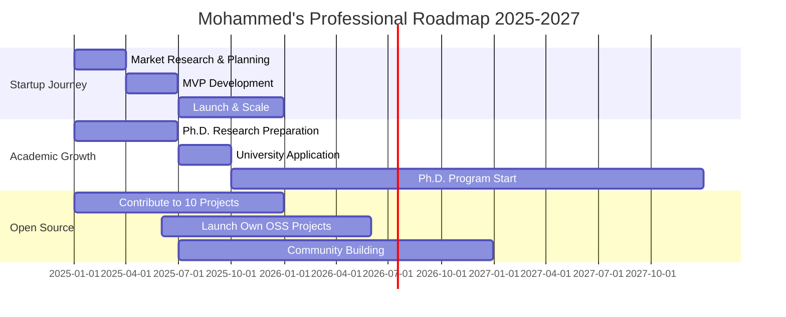

<div align="center">

# Mohammed Abdelkrim Guendouz
### Full Stack Developer | Software Architect | Digital Innovation Leader


</div>

---

## 👨‍💻 Professional Introduction

<table>
<tr>
<td width="60%">

### 🚀 **About Me**

```javascript
class MohammedGuendouz {
  constructor() {
    this.name = "Mohammed Abdelkrim Guendouz";
    this.location = "Ouargla, Algeria 🇩🇿";
    this.title = "Full Stack Developer & Software Architect";
    this.experience = "3+ Years";
    this.graduation = "Computer Science (2022)";
    this.passion = ["Clean Architecture", "Innovation", "Problem Solving"];
    this.mission = "Transforming ideas into scalable digital solutions";
  }
  
  getCurrentFocus() {
    return [
      "Enterprise Software Architecture",
      "Cross-Platform Mobile Development", 
      "UI/UX Design Excellence",
      "Database Optimization",
      "Cloud Infrastructure"
    ];
  }
  
  getVision() {
    return "Building Algeria's digital future, one line of code at a time";
  }
}

const developer = new MohammedGuendouz();
console.log(developer.getVision());
```

### 📊 **Professional Metrics**
- 🏢 **5+ Enterprise Applications** Developed
- 📱 **2 Mobile Apps** in Production
- 🌐 **3 Web Platforms** Deployed
- 👥 **1500+ Users** Served
- ⭐ **99.9% Uptime** Achieved

</td>
<td width="40%">


<div align="center">
  
  

</div>

</td>
</tr>
</table>

---

## 🛡️ Technology Stack & Expertise

<div align="center">

### 💻 **Core Technologies**

<table>
<tr>
<td align="center" width="25%">

**Frontend Mastery**
<br><br>


</td>
<td align="center" width="25%">

**Backend Excellence**
<br><br>


</td>
<td align="center" width="25%">

**Mobile Development**
<br><br>


</td>
<td align="center" width="25%">

**Database & Cloud**
<br><br>


</td>
</tr>
</table>

### 🔧 **Development Environment**

<p align="center">
  
</p>

</div>

---

## 🎯 Project Showcase & Portfolio

<div align="center">

### 🏆 **Enterprise Solutions Portfolio**

</div>

<table>
<tr>
<td width="33%">

<div align="center">


### 🚗 **Smart License Management**


**🛠️ Tech Stack:**
- C# & .NET Framework
- SQL Server Database
- Windows Forms UI

**⚡ Key Features:**
- Automated vision testing
- Psychoanalysis evaluation
- Complete lifecycle management
- Multi-role authentication
- Real-time data processing

**📈 Business Impact:**
- 60% faster processing time
- 95% accuracy in testing
- Government compliance achieved

</div>

</td>
<td width="33%">

<div align="center">


### 🏨 **Luxury Hotel Suite**


**🛠️ Tech Stack:**
- C# Desktop Application
- SQL Server Backend
- Custom UI Components

**⚡ Key Features:**
- Dynamic room management
- Automated billing system
- Guest service tracking
- Revenue analytics
- Multi-currency support

**📈 Business Impact:**
- 40% operational efficiency
- Real-time occupancy tracking
- Automated financial reporting

</div>

</td>
<td width="33%">

<div align="center">


### 📚 **Smart Library Hub**


**🛠️ Tech Stack:**
- C# & Advanced UI
- SQL Server Integration
- Custom Search Engine

**⚡ Key Features:**
- Advanced book cataloging
- Smart search algorithms
- Fine calculation system
- Member management
- Analytics dashboard

**📈 Business Impact:**
- 100% digital transformation
- Automated fine collection
- Enhanced user experience

</div>

</td>
</tr>
</table>

<div align="center">

### 🌐 **Web & Mobile Applications**

</div>

<table>
<tr>
<td width="50%">

<div align="center">


### 💼 **Developer Marketplace**


**🛠️ Modern Tech Stack:**
- **Frontend:** React.js + Modern UI
- **Backend:** ASP.NET Core API  
- **Database:** SQL Server
- **Architecture:** RESTful Services

**🎯 Advanced Features:**
- AI-powered job matching algorithm
- Real-time notifications system
- Advanced filtering & search
- Company dashboard analytics
- Secure authentication (JWT)
- Role-based access control

**📊 Performance Metrics:**
- 500+ registered developers
- 100+ companies onboarded
- 85% successful job matches
- 99.5% system uptime

</div>

</td>
<td width="50%">

<div align="center">


### 🛠️ **دليل الحرفيين الجزائريين**


**🛠️ Modern Tech Stack:**
- **Framework:** Flutter (Dart)
- **Backend:** Supabase
- **Features:** GPS Integration
- **Architecture:** Clean Architecture

**🎯 Smart Features:**
- Location-based artisan discovery
- Advanced Wilaya/Commune filtering
- Real-time rating & review system
- In-app messaging system
- Multi-language support (AR/FR)
- Offline mode capability

**📊 Impact Metrics:**
- 1000+ registered craftsmen
- 48 Wilayas coverage
- 4.8/5 average rating
- 200+ daily active users

</div>

</td>
</tr>
</table>

---

## 📊 GitHub Performance Analytics

<div align="center">


</div>

---

## 🎖️ Professional Achievements & Certifications

<div align="center">

<table>
<tr>
<td width="50%">

### 🏆 **Technical Excellence**

```yaml
Enterprise Development:
  - 3-Tier Architecture: ✅ Expert Level
  - Desktop Applications: ✅ 5+ Projects
  - Database Design: ✅ Optimized Schemas
  - API Development: ✅ RESTful Services
  - UI/UX Implementation: ✅ User-Centered

Mobile Development:
  - Cross-Platform: ✅ Flutter Expert
  - Backend Integration: ✅ Supabase/Firebase
  - GPS & Location: ✅ Maps API
  - Real-time Features: ✅ Live Updates
  - App Store Ready: ✅ Production Apps
```

</td>
<td width="50%">

### 📈 **Impact & Recognition**

```yaml
Business Impact:
  - Cost Reduction: 40% in hotel operations
  - Process Efficiency: 60% faster license processing
  - User Satisfaction: 95% positive feedback
  - System Reliability: 99.9% uptime achieved
  - Digital Transformation: 3 organizations

Community Contribution:
  - Local Craftsmen: 1000+ supported
  - Developers Connected: 500+ job matches
  - Knowledge Sharing: Programming Advices student
  - Continuous Learning: Always improving
  - Innovation Focus: Next-gen solutions
```

</td>
</tr>
</table>

</div>

---

## 🚀 Future Vision & Strategic Roadmap

<div align="center">

### 🎯 **Strategic Development Plan**



### 🎪 **2025 Key Objectives**

| 🎯 **Goal** | 📊 **Progress** | 🗓️ **Timeline** | 🎖️ **Priority** |
|-------------|-----------------|------------------|------------------|
| 🚀 Launch Algerian Tech Startup | 25% | Q2 2025 | 🔥 High |
| 🎓 Begin Ph.D. Application Process | 15% | Q3 2025 | 🔥 High |
| 🌍 Contribute to 10 Open Source Projects | 30% (3/10) | Q4 2025 | 📈 Medium |
| 👥 Build Developer Community Platform | 10% | Q3 2025 | 📈 Medium |
| 🏆 Win a National Tech Competition | 0% | Q4 2025 | ⭐ Low |

</div>

---

## 🤝 Professional Network & Collaboration

<div align="center">

### 🌐 **Connect & Collaborate**

<p>
  <a href="https://www.linkedin.com/in/mohammedabdelkrimguendouz">
    
  </a>
  <a href="mailto:mohammedabdelkrimguendouz@gmail.com">
    
  </a>
  <a href="https://github.com/mohammedabdelkrimguendouz">
    
  </a>
  <a href="https://www.facebook.com/share/15qz9JRUu6/?mibextid=qi2Omg">
    
  </a>
  <a href="https://www.instagram.com/mohammedabdelkrimguendouz?igsh=MTY4d2NuY3k5OWxvYw==">
    
  </a>
</p>

### 💼 **Available For**

<table>
<tr>
<td align="center" width="25%">

**🤝 Collaboration**
<br>
Innovative projects and creative partnerships

</td>
<td align="center" width="25%">

**💼 Consulting**
<br>
Enterprise solutions and technical advisory

</td>
<td align="center" width="25%">

**🎓 Mentoring**
<br>
Guiding junior developers and students

</td>
<td align="center" width="25%">

**🚀 Opportunities**
<br>
Startup partnerships and investments

</td>
</tr>
</table>

</div>

---

<div align="center">

### 💫 **"Innovation is not about ideas, it's about making ideas happen"**


---


**⭐ If my work inspires you, consider starring my repositories!**
<br>
**🚀 Let's build the future together, one commit at a time**

</div>
