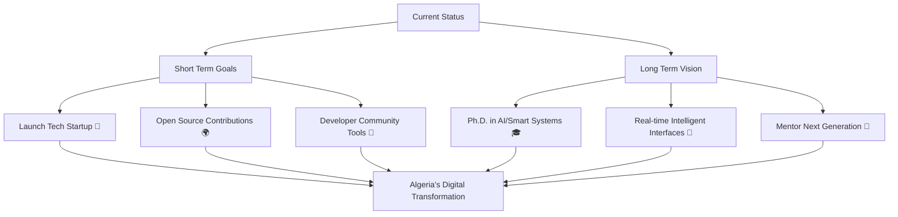

# Mohammed Abdelkrim Guendouz

<div align="center">
  
  

  

  <p align="center">
    
    
    
  </p>

</div>

---

## 🌟 Professional Overview

<div align="center">
  <table>
    <tr>
      <td width="50%">
        
### 🎯 **Current Status**
```yaml
Name: Mohammed Abdelkrim Guendouz
Location: Ouargla, Algeria 🇩🇿
Role: Full Stack Developer & UI/UX Designer
Experience: 3+ Years in Software Development
Education: Computer Science Graduate (2022)
Focus: Enterprise Solutions & Mobile Apps
```

      </td>
      <td width="50%">
        
### 🚀 **Mission Statement**
```typescript
const mission = {
  vision: "Driving Algeria's digital transformation",
  expertise: ["Full Stack Development", "UI/UX Design"],
  impact: "Building scalable enterprise solutions",
  goal: "Creating Algeria's next tech unicorn 🦄"
};
```

      </td>
    </tr>
  </table>
</div>

---

## 🛠️ Technical Expertise

<div align="center">

### Frontend Development
<p>
  
</p>

### Backend Development
<p>
  
</p>

### Database & Cloud
<p>
  
</p>

### Development Tools
<p>
  
</p>

</div>

---

## 🏆 Featured Projects Portfolio

<div align="center">

### 🌟 **Enterprise Solutions**

<table>
<tr>
<td width="33%">

<div align="center">
  
  
  **🚗 Smart License Management**
  
  
  
  
  ✨ **Features:**
  - Automated testing system
  - Vision & psychoanalysis tests
  - Complete lifecycle management
  - Secure authentication
  
  📊 **Impact:** Streamlined license processing for government agencies
</div>

</td>
<td width="33%">

<div align="center">
  
  
  **🏨 Luxury Hotel Suite**
  
  
  
  
  ✨ **Features:**
  - Room reservation system
  - Service management
  - Automated billing
  - Revenue tracking
  
  📊 **Impact:** Optimized hotel operations with 40% efficiency increase
</div>

</td>
<td width="33%">

<div align="center">
  
  
  **📚 Smart Library Hub**
  
  
  
  
  ✨ **Features:**
  - Advanced book tracking
  - User management
  - Automated notifications
  - Analytics dashboard
  
  📊 **Impact:** Digitized library operations for 10,000+ books
</div>

</td>
</tr>
</table>

### 🌐 **Web Applications**

<table>
<tr>
<td width="50%">

<div align="center">
  
  
  **💼 Developer Job Marketplace**
  
  
  
  
  
  ✨ **Features:**
  - AI-powered job matching
  - Company dashboards
  - Role-based access control
  - Advanced filtering system
  
  📊 **Impact:** Connecting 500+ developers with opportunities
</div>

</td>
<td width="50%">

<div align="center">
  
  
  **🛠️ دليل الحرفيين الجزائريين**
  
  
  
  
  ✨ **Features:**
  - Location-based discovery
  - Wilaya/Commune filtering
  - Rating & review system
  - Real-time notifications
  
  📊 **Impact:** Supporting 1000+ local Algerian craftsmen
</div>

</td>
</tr>
</table>

</div>

---

## 📊 GitHub Analytics & Activity

<div align="center">
  
  
  
  
  
  

</div>

<div align="center">
  
</div>

---

## 🎯 Professional Achievements

<div align="center">

<table>
<tr>
<td width="50%">

### 🏆 **Development Milestones**
- ✅ **3 Enterprise Systems** - Complete 3-tier architecture
- ✅ **Full Stack Expertise** - React + .NET + SQL Server
- ✅ **Mobile Development** - Flutter with Supabase integration
- ✅ **UI/UX Design** - Figma to code implementation
- ✅ **Database Architecture** - Optimized SQL Server schemas

</td>
<td width="50%">

### 📈 **Impact Metrics**
- 📊 **10,000+** Books managed in library system
- 🏨 **40%** Efficiency increase in hotel operations  
- 👥 **500+** Developers connected through job platform
- 🛠️ **1,000+** Local craftsmen supported via mobile app
- 🎓 **Continuous Learning** from Programming Advices

</td>
</tr>
</table>

</div>

---

## 🚀 Future Roadmap & Vision

<div align="center">



</div>

<div align="center">

### 🎯 **2025 Objectives**
| Goal | Status | Timeline |
|------|--------|----------|
| 🚀 Launch Algerian Tech Startup | 🔄 In Progress | Q2 2025 |
| 🌍 Contribute to 10 Open Source Projects | 📈 3/10 | Q4 2025 |
| 👥 Build Developer Community Platform | 💡 Planning | Q3 2025 |
| 🎓 Start Ph.D. Application Process | 📋 Research | Q4 2025 |

</div>

---

## 💼 Professional Network

<div align="center">

### 🤝 **Let's Connect & Collaborate**

<p>
  <a href="https://www.linkedin.com/in/mohammedabdelkrimguendouz">
    
  </a>
  <a href="mailto:mohammedabdelkrimguendouz@gmail.com">
    
  </a>
  <a href="https://github.com/mohammedabdelkrimguendouz">
    
  </a>
  <a href="https://www.facebook.com/share/15qz9JRUu6/?mibextid=qi2Omg">
    
  </a>
  <a href="https://www.instagram.com/mohammedabdelkrimguendouz?igsh=MTY4d2NuY3k5OWxvYw==">
    
  </a>
</p>

### 📬 **Open for Opportunities**
- 🤝 **Collaboration** on innovative projects
- 💼 **Consulting** for enterprise solutions
- 🎓 **Mentoring** junior developers
- 🚀 **Startup** partnerships and investments

</div>

---

<div align="center">

### 🌟 **"Code with Purpose, Build with Passion"**


**⭐ If you find my work interesting, don't forget to star my repositories!**

</div>
